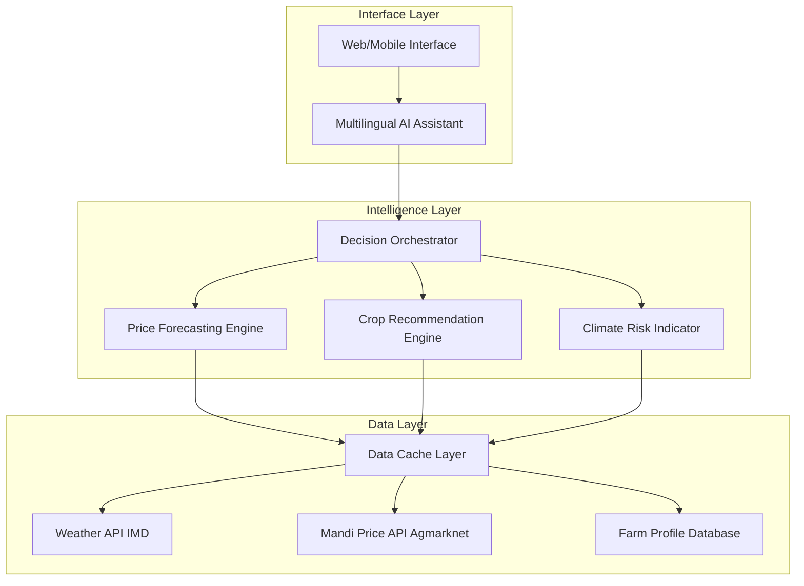

# Design Document: GramSaar AI – Rural Decision Intelligence Platform

## Overview

GramSaar AI is architected as a modular decision intelligence layer that transforms raw agricultural data into actionable farmer insights. The system follows a three-tier architecture:

1. **Data Layer**: Ingests and normalizes data from public APIs (weather, market prices) and synthetic farm profiles
2. **Intelligence Layer**: Implements ML models for price forecasting, crop recommendations, and risk scoring
3. **Interface Layer**: Provides multilingual conversational AI interface with explainable outputs

The design prioritizes:
- **Modularity**: Each engine (price forecasting, crop recommendation, risk scoring) operates independently as cohesive modules within a monolithic architecture
- **Explainability**: All recommendations include transparent reasoning and data provenance
- **MVP Realism**: Simple, proven approaches over complex distributed systems
- **Extensibility**: Clear module boundaries enable future enhancements without architectural rewrites

## Architecture

### System Architecture Diagram



### Data Flow

1. **User Query**: Farmer inputs query via web interface (text or voice)
2. **Intent Recognition**: AI Assistant parses query, extracts entities (crop, location, time period)
3. **Orchestration**: Decision Orchestrator routes request to appropriate engines
4. **Data Retrieval**: Engines fetch required data from cache or external APIs
5. **Computation**: ML models generate predictions/recommendations
6. **Explanation Generation**: System constructs reasoning chain with data sources
7. **Response**: AI Assistant formats response in user's language with visual aids

## Components and Interfaces

### 1. Price Forecasting Engine

**Purpose**: Predict crop prices for next 3-6 months using time series analysis

**Input Interface**:
```python
class PriceForecastRequest:
    crop: str  # e.g., "wheat", "soybean"
    region: str  # district or state code
    forecast_horizon: int  # months ahead (1-6)
    confidence_level: float  # default 0.95
```

**Output Interface**:
```python
class PriceForecastResponse:
    crop: str
    region: str
    predictions: List[PricePoint]  # [(date, price, lower_bound, upper_bound)]
    model_confidence: float  # 0-1 score
    mape: float  # mean absolute percentage error
    data_sources: List[str]  # ["Agmarknet 2021-2024"]
    warnings: List[str]  # e.g., ["Low confidence due to limited data"]
```

**Algorithm (MVP)**:
- **Model Choice**: Facebook Prophet for time series forecasting
  - Handles seasonality (Kharif/Rabi cycles) and trend decomposition automatically
  - Provides built-in uncertainty intervals without additional complexity
  - Well-documented, production-ready library with minimal tuning required
- **Training**: Rolling window of 3 years historical data, retrained weekly
- **Features**: Historical prices, seasonal indicators (Kharif/Rabi), weather forecast (rainfall, temperature)
- **Validation**: Evaluated using historical backtesting

**Why Prophet for MVP**:
- Robust to missing data and outliers (common in mandi price datasets)
- Interpretable components (trend, seasonality) align with explainability requirements
- Fast inference (<100ms per forecast) suitable for real-time API responses

**Confidence Scoring**:
```
confidence = 1 - (MAPE / 100)
if MAPE > 15% or confidence < 0.7:
    flag as low confidence
```

### 2. Crop Recommendation Engine

**Purpose**: Recommend top 3 crops based on farm context and market conditions

**Input Interface**:
```python
class CropRecommendationRequest:
    location: Location  # lat, lon, district
    soil_type: str  # "clay", "loam", "sandy", "black"
    farm_size: float  # hectares
    season: str  # "kharif", "rabi"
    farmer_history: Optional[List[CropYield]]  # past crops and yields
```

**Output Interface**:
```python
class CropRecommendationResponse:
    recommendations: List[CropRecommendation]  # top 3
    
class CropRecommendation:
    crop: str
    suitability_score: float  # 0-100
    reasoning: ReasoningChain
    expected_yield: float  # quintals per hectare
    expected_revenue: float  # INR per hectare
    risk_level: str  # "Low", "Medium", "High"
    
class ReasoningChain:
    factors: List[Factor]  # [(factor_name, weight, value, explanation)]
    # e.g., [("Rainfall Forecast", 0.3, 850mm, "Optimal for soybean")]
```

**Algorithm (Hybrid Approach for MVP)**:

The MVP uses a two-stage hybrid approach that balances simplicity with intelligent prioritization:

**Stage 1: Rule-Based Agronomic Filtering (Hard Constraints)**
- Apply agronomic best practices as hard filters to eliminate unsuitable crops
- Filters based on:
  - Soil type compatibility (e.g., rice requires clay/loam, not sandy soil)
  - Rainfall requirements (e.g., wheat needs 450-650mm, cotton needs 600-1200mm)
  - Temperature thresholds (e.g., wheat fails above 35°C during grain filling)
  - Season appropriateness (Kharif vs Rabi crops)
- Implementation: Lookup tables derived from ICAR crop guidelines and state agricultural universities
- Output: List of agronomically viable crops (typically 5-8 crops per region)

**Stage 2: ML-Weighted Scoring for Prioritization (Soft Ranking)**
- Rank viable crops using weighted scoring model
- **Scoring Factors**:
  1. **Soil Suitability** (30%): Degree of match between soil type and crop preference (0-1 scale)
  2. **Weather Compatibility** (35%): Alignment of forecast rainfall/temp with optimal crop ranges
  3. **Market Attractiveness** (25%): Forecasted price trend from Price Forecasting Engine
  4. **Historical Performance** (10%): Farmer's past yields for this crop (if available, else use regional average)

**Removed from MVP**: Input availability proxy (seed/fertilizer) - not realistically implementable without supply chain integration

**Suitability Calculation**:
```
suitability_score = Σ(weight_i × normalized_factor_i)
where normalized_factor_i ∈ [0, 1]

# Normalization examples:
soil_score = lookup_table[soil_type][crop]  # 0.3 (poor) to 1.0 (excellent)
weather_score = 1 - |forecast_rainfall - optimal_rainfall| / optimal_rainfall
market_score = (forecasted_price - current_price) / current_price  # capped at [0, 1]
```

**Why Hybrid Approach**:
- Rule-based filters ensure agronomic validity (no recommending rice in desert regions)
- ML scoring provides intelligent prioritization without requiring large training datasets
- Explainable by design: each factor has clear interpretation
- Weights can be tuned based on expert feedback without retraining models

**Reasoning Generation**:
- Extract top 3 factors by weight × value contribution
- Generate natural language explanation for each factor with data citations
- Example: "Soybean scored 0.85 due to: (1) Optimal rainfall forecast of 850mm (IMD), (2) Black soil suitability (ICAR guidelines), (3) Price trending up 12% (Agmarknet)"

### 3. Multilingual AI Assistant

**Purpose**: Conversational interface for farmer queries in Hindi and English

**Architecture**:
- **LLM Backend**: OpenAI GPT-4 or Anthropic Claude with agricultural domain fine-tuning via prompt engineering
- **Prompt Structure**:
  ```
  System: You are an agricultural advisor for Indian farmers. Respond in {language}.
  Use simple language, avoid jargon. Always cite data sources.
  
  Context: {farm_profile}, {weather_data}, {price_data}
  
  User Query: {query}
  
  Available Tools: [price_forecast, crop_recommendation, risk_assessment]
  ```

**Query Processing Pipeline**:
1. **Language Detection**: Detect Hindi vs English using langdetect library
2. **Intent Classification**: Map query to tool (price_forecast, crop_recommendation, general_info)
3. **Entity Extraction**: Extract crop names, locations, time periods using NER
4. **Tool Invocation**: Call appropriate engine with extracted parameters
5. **Response Generation**: Format engine output into conversational response
6. **Translation**: Ensure response is in user's language with agricultural terminology

**Conversation State Management**:
- Maintain session context for follow-up questions
- Store last query, last recommendation, and farm profile in session
- Enable clarification questions (e.g., "Which crop did you mean - wheat or rice?")

**Example Interaction**:
```
User (Hindi): "Meri zameen par kya ugana chahiye? Mitti kaali hai aur barish achhi hogi."

Assistant (Hindi): "Aapki kaali mitti aur achhi barish ke liye soybean sabse achha vikalp hai. 
Karan:
1. Kaali mitti mein soybean ki paidawar 15-20 quintal/hectare hoti hai
2. IMD ke anumaan ke anusaar 850mm barish hogi - soybean ke liye ideal
3. Soybean ki kimat Rs 4,200/quintal tak badh sakti hai (Agmarknet data)

Kya aap soybean ke baare mein aur jaankari chahte hain?"
```

### 4. Climate Risk Indicator

**Purpose**: Assess climate-related risks for crop-location combinations

**Input Interface**:
```python
class RiskAssessmentRequest:
    crop: str
    location: Location
    season: str
    forecast_period: int  # days ahead
```

**Output Interface**:
```python
class RiskAssessmentResponse:
    risk_level: str  # "Low", "Medium", "High"
    risk_score: float  # 0-100
    risk_factors: List[RiskFactor]
    mitigation_advice: List[str]
    historical_context: str  # e.g., "2 droughts in last 5 years"
    
class RiskFactor:
    factor: str  # "Drought", "Excess Rainfall", "Heat Stress"
    probability: float  # 0-1
    impact: str  # "Low", "Medium", "High"
    explanation: str
```

**Risk Scoring Algorithm**:
```
risk_score = Σ(probability_i × impact_i × crop_vulnerability_i)

where:
- probability_i: likelihood of weather event (from forecast)
- impact_i: severity if event occurs (1=Low, 2=Medium, 3=High)
- crop_vulnerability_i: crop-specific sensitivity (lookup table)
```

**Risk Factors Analyzed (MVP Scope)**:
1. **Drought Risk**: If forecasted rainfall < 75% of historical average for the region
2. **Excess Rainfall Risk**: If forecasted rainfall > 125% of historical average
3. **Heat Stress Risk**: If max temperature > crop-specific threshold during critical growth stages
4. **Frost Risk**: If min temperature < crop-specific threshold (Rabi season only)

**Removed from MVP**: Pest outbreak modeling - requires entomological datasets and disease spread models beyond 15-day scope. This is a complex domain requiring integration with pest surveillance systems.

**Why This Scope is Realistic**:
- Weather-based risks are computable from IMD API data alone
- Crop vulnerability thresholds are well-documented in agricultural literature
- Risk scoring remains interpretable and actionable for farmers

**Crop Vulnerability Matrix** (example):
```
Crop        | Drought | Excess Rain | Heat Stress
------------|---------|-------------|------------
Wheat       | Medium  | Low         | Medium
Rice        | High    | Low         | Low
Soybean     | Medium  | Medium      | Medium
Cotton      | High    | Medium      | High
Maize       | Medium  | Medium      | Medium
```

### 5. Decision Orchestrator

**Purpose**: Route user queries to appropriate engines and aggregate results

**Architecture Note**: This is a simple routing layer within a modular monolith, not a distributed microservices orchestrator. All engines run in the same process space for MVP simplicity.

**Responsibilities**:
- Parse AI Assistant's tool invocation requests
- Fetch farm profile and contextual data from local database
- Call engine functions sequentially (parallel execution is premature optimization for MVP scale)
- Aggregate results into unified response structure
- Implement in-memory caching for repeated queries within same session

**Orchestration Logic**:
```python
def handle_query(query: UserQuery) -> Response:
    # Extract intent and entities (delegated to LLM via function calling)
    intent = classify_intent(query.text)
    entities = extract_entities(query.text)
    
    # Fetch context from local database
    farm_profile = get_farm_profile(query.user_id)
    weather = get_weather_forecast(farm_profile.location)  # from cache or API
    
    # Route to engines (simple function calls, not RPC)
    if intent == "crop_recommendation":
        crop_rec = crop_engine.recommend(farm_profile, weather)
        risk = risk_engine.assess(crop_rec.top_crop, farm_profile.location)
        price = price_engine.forecast(crop_rec.top_crop, farm_profile.location)
        
        return aggregate_response(crop_rec, risk, price)
    
    elif intent == "price_forecast":
        crop = entities.get("crop")
        price = price_engine.forecast(crop, farm_profile.location)
        return format_price_response(price)
    
    # ... other intents
```

**Why Simple Orchestration Works for MVP**:
- Expected load: 100 concurrent users (per requirements) - single-server capacity
- Engine execution time: <2 seconds per query - no need for async complexity
- Monolithic deployment simplifies debugging and iteration during hackathon

### 6. Data Layer

**Components**:

**a) Weather API Integration**:
- **Source**: India Meteorological Department (IMD) OpenAPI
- **Data**: 7-day forecast (rainfall, temperature, humidity), seasonal outlook
- **Refresh**: Daily at 6 AM IST
- **Fallback**: Use historical averages if API unavailable

**b) Mandi Price API Integration**:
- **Source**: Agmarknet or data.gov.in agricultural datasets
- **Data**: Daily wholesale prices for major crops across mandis
- **Refresh**: Weekly (prices updated every Monday)
- **Storage**: PostgreSQL with time-series indexing

**c) Farm Profile Database**:
- **Storage**: PostgreSQL with time-series indexing
- **Schema**: Farm profiles (location, soil type, farm size), crop history (crop, season, year, yield, revenue)
- **Purpose**: Store farmer context for personalized recommendations

**d) Cache Layer**:
- **Technology**: Redis for in-memory caching
- **Cached Data**: Weather forecasts, price forecasts, crop recommendations
- **Strategy**: Cache frequently accessed data with appropriate TTLs to reduce API calls

## Data Models

### AI Workflow Pipeline

**High-Level Flow**:

1. **Data Ingestion**: Fetch weather forecasts (IMD API), mandi prices (Agmarknet), and farm profiles from PostgreSQL
2. **Preprocessing**: Normalize units, handle missing values with historical averages, validate inputs
3. **Feature Engineering**: Create time series features for forecasting, compute rainfall deviations, temperature stress indicators, and soil-crop compatibility scores
4. **Model Inference**:
   - **Price Forecasting**: Prophet model generates 3-month forecasts with uncertainty intervals
   - **Crop Recommendation**: Agronomic filters + weighted scoring rank top 3 crops
   - **Risk Assessment**: Weather-based scoring classifies risk as Low/Medium/High
5. **Explanation Generation**: Extract top contributing factors, map to natural language templates, attach data source citations
6. **Response Formatting**: LLM converts structured predictions into conversational responses in user's language (Hindi/English)

**Data Flow**:
```
[IMD API / Agmarknet / Farm DB] ──> [Preprocessing] ──> [Feature Engineering] ──> [Model Inference]
                                                                                          │
[User Query] ──> [LLM Intent Parsing] ──> [Orchestrator] ────────────────────────────────┘
                                                │                                          │
                                                │                                          ▼
                                                │                                  [Explanation Generation]
                                                │                                          │
                                                ▼                                          ▼
                                          [Response Formatting] <──────────────────────────┘
                                                │
                                                ▼
                                          [User Response]
```

**AI-Centric Design**:
- **LLM**: Handles intent parsing, entity extraction, and multilingual response generation
- **Prophet**: Provides probabilistic forecasts with confidence intervals
- **Explainability**: Every prediction includes transparent reasoning with data citations
- **Responsible AI**: System acknowledges uncertainty and suggests expert consultation when confidence is low

### Core Domain Models

```python
from dataclasses import dataclass
from datetime import date
from typing import List, Optional

@dataclass
class Location:
    latitude: float
    longitude: float
    district: str
    state: str
    pincode: Optional[str] = None

@dataclass
class FarmProfile:
    id: str
    location: Location
    soil_type: str  # "clay", "loam", "sandy", "black"
    farm_size: float  # hectares
    crop_history: List['CropYield']
    created_at: date

@dataclass
class CropYield:
    crop: str
    season: str  # "kharif", "rabi"
    year: int
    yield_per_hectare: float  # quintals
    revenue: float  # INR

@dataclass
class WeatherForecast:
    location: Location
    forecast_date: date
    rainfall_mm: float
    temperature_max: float
    temperature_min: float
    humidity: float
    confidence: float  # 0-1

@dataclass
class PricePoint:
    date: date
    price: float  # INR per quintal
    lower_bound: float
    upper_bound: float
    
@dataclass
class MandiPrice:
    crop: str
    mandi_name: str
    district: str
    state: str
    date: date
    modal_price: float  # most common price
    min_price: float
    max_price: float
```

### API Request/Response Models

```python
@dataclass
class UserQuery:
    user_id: str
    session_id: str
    text: str
    language: str  # "hi", "en"
    timestamp: date

@dataclass
class AssistantResponse:
    text: str
    language: str
    recommendations: Optional[List[CropRecommendation]]
    price_forecast: Optional[PriceForecastResponse]
    risk_assessment: Optional[RiskAssessmentResponse]
    data_sources: List[str]
    confidence: float
    follow_up_suggestions: List[str]
```

## Reliability & Transparency Guarantees

These guarantees ensure the system delivers trustworthy, explainable recommendations aligned with requirements.

**1. Complete Forecasts with Confidence Handling**
- All price forecasts include 3-month predictions with uncertainty intervals
- Low-confidence warnings trigger when MAPE >15% or confidence <0.7
- *Validates: Requirements 1.1, 1.5*

**2. Structured Crop Recommendations**
- Every recommendation includes exactly 3 crops with suitability scores (0-100)
- Each crop includes reasoning with at least 3 factors and data source citations
- *Validates: Requirements 2.1, 2.5*

**3. Multilingual Response Consistency**
- Response language always matches query language (Hindi/English)
- Agricultural terminology appropriate for rural users, avoiding technical jargon
- *Validates: Requirements 3.1, 3.2, 3.7*

**4. Risk Classification Accuracy**
- Risk scores (0-100) computed from weather forecast data
- Risk levels follow defined thresholds: Low (0-33), Medium (34-66), High (67-100)
- *Validates: Requirements 4.1, 4.2*

**5. Data Source Attribution**
- All recommendations include explicit citations (e.g., "IMD forecast dated YYYY-MM-DD")
- Enables transparency and trust through data provenance
- *Validates: Requirements 7.1*

**6. Confidence-Based Warnings**
- System advises expert consultation when confidence <0.7 or MAPE >15%
- Acknowledges uncertainty rather than presenting false certainty
- *Validates: Requirements 1.5, 3.6, 7.4*

## Implementation Feasibility

**Proven Technologies**:
- Prophet (Facebook's time series library), LLM APIs (OpenAI/Anthropic), PostgreSQL + Redis, Flask/FastAPI
- All production-ready with extensive documentation

**Public Datasets**:
- IMD Weather API (free, documented JSON API)
- Agmarknet price data (CSV downloads from data.gov.in)
- Synthetic farm profiles (Python Faker library)
- ICAR crop knowledge base (publicly available)

**Modular Monolith Benefits**:
- Single Python process - no distributed system complexity
- Shared database connection pool
- Single deployment artifact
- Straightforward debugging

**Scope Discipline**:
- NOT building: Custom LLM training, distributed microservices, real-time streaming, mobile apps, satellite imagery analysis, real-time soil testing
- Focus: Core decision intelligence with proven ML approaches

**Risk Mitigation**:
- API failures use cached data
- Conservative confidence thresholds (0.7)
- Input validation and graceful degradation
- Initial MVP focuses on a limited set of crops and regions for focused validation and iterative improvement

## Post-Hackathon Extensibility

- Add regional languages via LLM APIs (support for 50+ languages)
- Integrate real farmer data using existing schema
- Deploy as single Docker container to cloud infrastructure

## Error Handling

The system implements graceful degradation for common failure scenarios:

**API Failures**:
- Weather API (IMD) unavailable: Use cached forecast with timestamp warning
- Mandi Price API stale: Use last available data, increase uncertainty intervals, flag low confidence
- LLM API failures: Fall back to template-based responses with structured data output

**Model Failures**:
- Price forecast model errors: Fall back to simple moving average, set medium-low confidence
- Crop recommendation edge cases: Relax agronomic filters by 10%, recommend resilient crops with warnings

**Data Validation**:
- Invalid inputs: Return descriptive errors, LLM asks clarifying questions
- Missing farm profile: Use regional averages, inform user accuracy will improve over time

**System Degradation**:
- High load scenarios: Implement basic request throttling and graceful retry messaging
- Database failures: Enable read-only mode using cached data, alert operations team